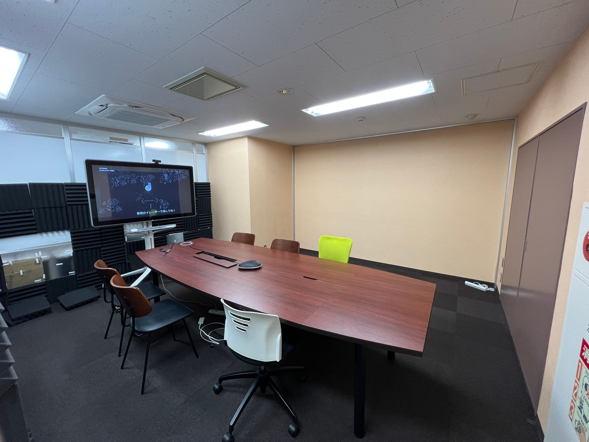
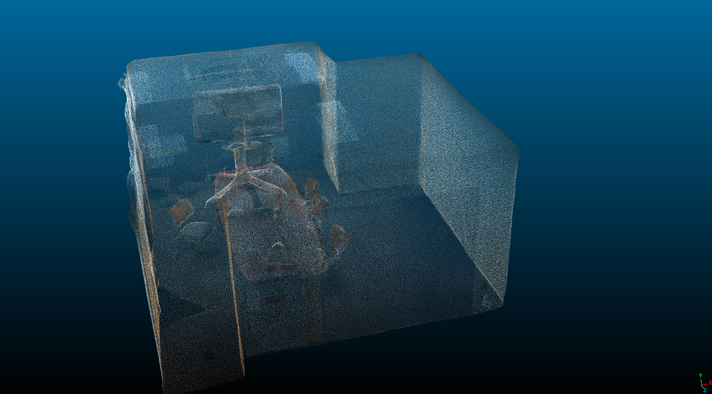
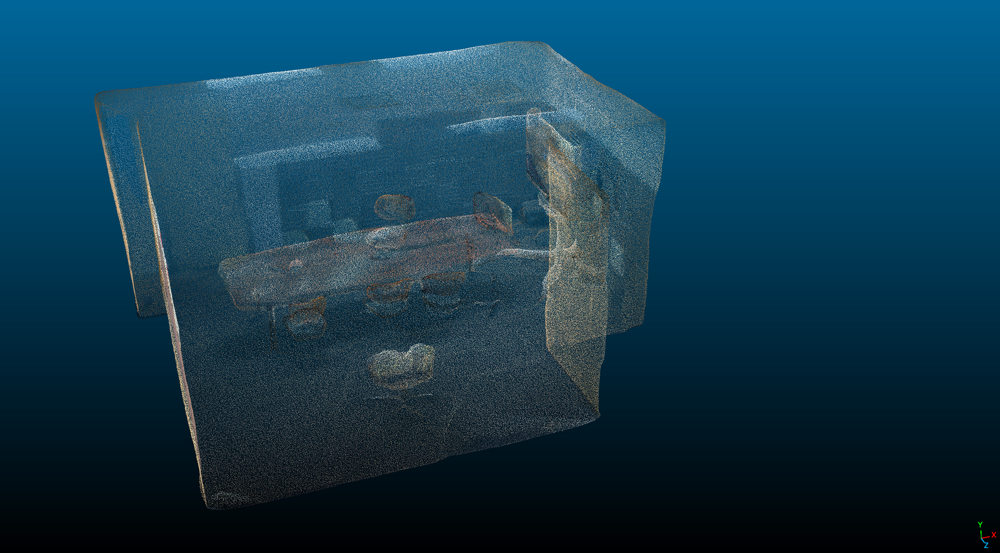
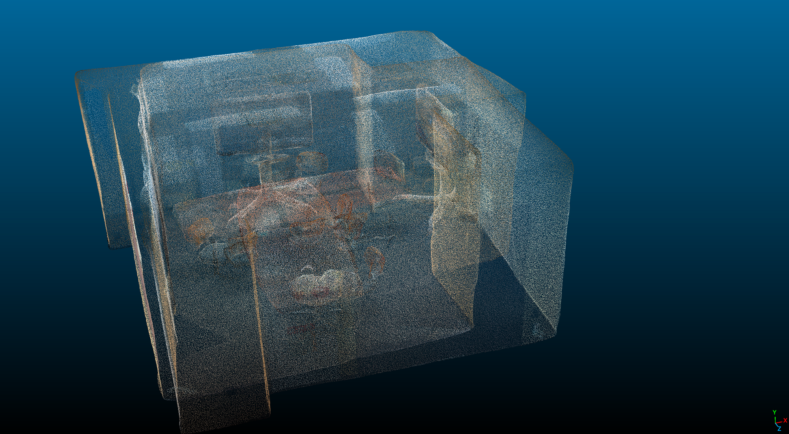
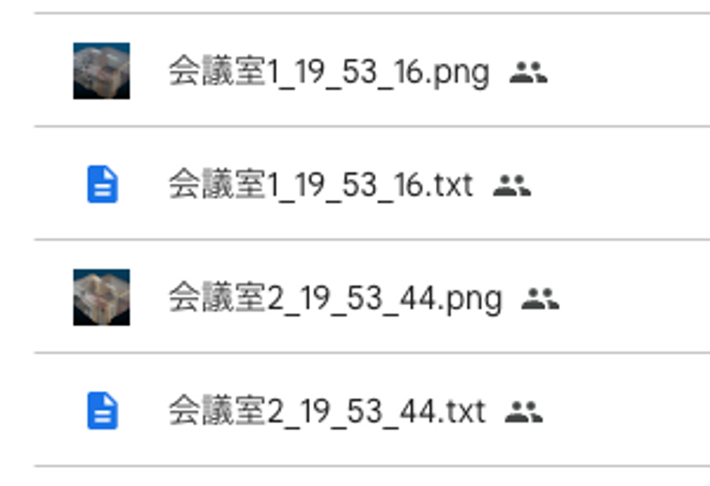

# 燈株式会社 アルゴリズムエンジニアインターン課題

**⚠️注意事項**

**- 期限は厳守をお願いいたします**

**- 提出期限に遅れた場合は不合格となります**

## 点群とは？

点群とは、x, y, z 座標と r, g, b 色の 6 次元の情報を持った点の集まりです.

こちらは弊社オフィスの会議室の様子（画像）です.



こちらが会議室の点群です.

iPhone についている LiDAR を用いて撮影しました.

約 600,000 点からなります.


## 点群のレジストレーション

点群のレジストレーションがコーディング課題のテーマです

こちらが異なる日付に同じ会議室を撮影した点群です

点群を撮影し始める位置、測定器の角度などで、座標系が異なります




こちらが 2 つの点群を同じ座標系に同時に表示した様子で、



これらの座標系をピッタリ合わせる操作が “レジストレーション” です

## コーディング課題

### 1. 基礎課題
コマンドラインなど、開発に必要な基本的なツールの使い方を確認します。
UNIX 系 OS を前提として採点するため、Windows の方は [WSL2](https://learn.microsoft.com/ja-jp/windows/wsl/install) をインストールした上で取り組んでください。

詳細は [REPORT.md](./submissions/REPORT.md) を参照してください。

### 2. アルゴリズム課題
点群の ”レジストレーション” 方法を 1 つ以上サーベイし実装したのちに、スライドに精度や可視化をまとめていただきたいです. ただし、複数実装した場合は比較も入れてください.

条件は以下の通りです.

- 言語は Python を指定します
- 実装力を評価するために、アルゴリズム実装において使用できる外部ライブラリは numpy と matplotlib のみに限定させていただきます。
- パッケージ管理を [`poetry`](https://python-poetry.org/docs/) を使って実施してください。(`poetry.lock` もリポジトリに含めてください。)
- 関数には[型アノテーション](https://docs.python.org/ja/3/library/typing.html)をつけてください
- また、関数には[Googleスタイルのdocstring](https://sphinxcontrib-napoleon.readthedocs.io/en/latest/example_google.html)を書いてください
- **Notebook (`.ipynb`) の使用は禁止**です. 必ず Python モジュールで実装、提出してください.
- RMSE でレジストレーション精度を定量評価し、収束の様子をグラフ化(横軸:iter数, 縦軸:RMSE)してください.
  - RMSE は0.1mより大きい場合は、アルゴリズムが適切でないか収束していないため、改善してください。
  - もし精度改善の見込みがたたない場合はその考察をスライドに記載してください。
- 処理の過程でダウンサンプリングを行うことは問題ありませんが、RMSE はダウンサンプリングをしていない元の点数の点群で評価をお願いします.
- ご提出いただくスライドに実行結果の点群画像を含めるようお願いいたします。

## データ

弊社オフィスの点群データを 2 つお渡しします.

iPhone13 Pro - 3D Scanner App で撮影したもので、同じ部屋の点群を異なる時間に撮影したものです.

[コーディング課題 - Google Drive](https://drive.google.com/drive/folders/1pfJGtndXQUCEP9LB33u6Fsd100C6cBRq?usp=share_link)

会議室 1 と会議室 2 の点群(.txt)があり、この 2 つの点群をレジストレーションしていただきたいです

.png ファイルは点群を可視化したものです



txt ファイルの中身は以下のようになっており、列は左から x 座標, y 座標, z 座標, R, G, B が格納羅列されています

```
-0.66194999 -0.94863999 -2.17030001 122 128 116
-0.65724999 -0.94986999 -2.16067004 94 105 99
-0.64859998 -0.96243995 -2.15246987 117 124 116
-0.65402001 -0.95350999 -2.15465999 113 120 113
-0.67236996 -0.94255996 -2.15795994 126 133 116
-0.66560996 -0.94291997 -2.15421987 122 129 116
-0.65900999 -0.94861996 -2.15828991 123 129 117
-0.65196997 -0.99998999 -2.14028001 110 121 115
-0.64423996 -0.98416996 -2.14228988 111 122 114
```

## 参考図書

### 書籍：3 次元点群処理

[詳解 3 次元点群処理 Python による基礎アルゴリズムの実装 (KS 理工学専門書)](https://www.amazon.co.jp/詳解-3次元点群処理-Pythonによる基礎アルゴリズムの実装-KS理工学専門書-金崎/dp/406529343X/ref=sr_1_1?__mk_ja_JP=カタカナ&crid=XIDRF3U250QZ&keywords=点群&qid=1679530366&sprefix=てn,aps,1098&sr=8-1)


## 提出物
### 期限は原則 2 週間で、以下の提出をお願いいたします。
- 課題用Pull Request
- [インターン申込form](https://hrmos.co/pages/akariinc/jobs/1991348716750569511)
<br>※申し込みフォームはリンクより提出をお願いいたします。

### 課題用Pull Request実施手順
1. 作業用のブランチを作成し課題を実施
2. ```/submissions```フォルダ配下に以下の三点を格納
   1. 実装したソースコード全て
   2. 回答を記載した [REPORT.md](./submissions/REPORT.md)
   3. スライド
      1. 5 ページほどで pdf 形式で出力をお願いします.
      2. スライド構成の例
         1. 課題の要約 1 ページ
         2. 技術の説明 1〜3 ページ
         3. 結果 1〜2 ページ
         4. 考察 1 ページ
3. リポジトリにPull Requestを作成<br>
    - PRの出し方がわからない方はこちらの[記事](https://tonari-it.com/github-pull-request/)参照
    - また、マージは勝手に行わないようにしてください。
    - サブモジュール（submodule）は使用しないでください。 採点者が中身を確認できなくなるため、すべてのコード・ファイルはリポジトリ内に含めてください。
4. 面談担当者にPull Requestを出した旨を連絡

## 禁止事項

選考の内容や課題の内容を他人に口外したり、インターネットに公開することは禁止です。

ご不明点等あれば、面談担当者（課題が送られてきたメールアドレス宛）までご連絡ください.
